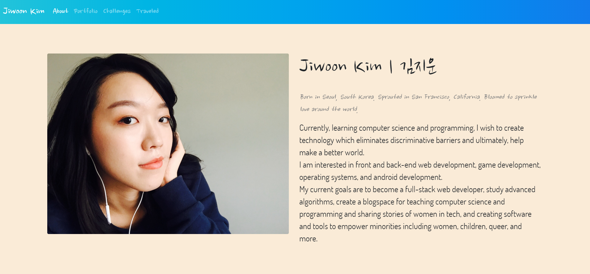
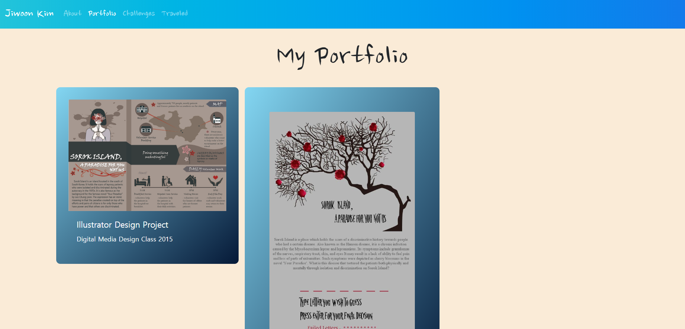
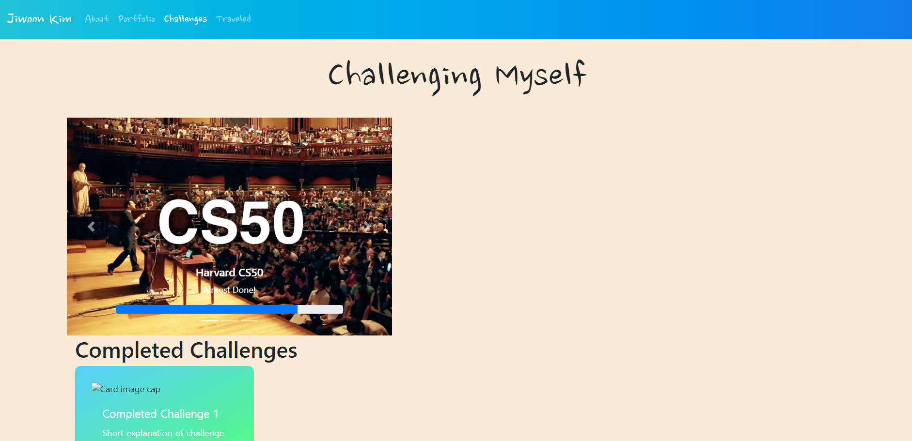
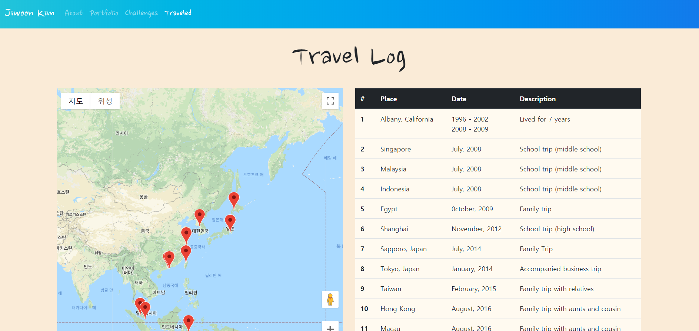

# Web50 Project | Web50 프로젝트
> Practicing Front-end development using html, css, bootstrap, sass, and javascript.

> html, css, bootstrap, sass, javascript를 바탕으로 한 프론트엔드 웹 개발 연습.

## Project 0: My First Web Page
- For CS50 Web Programming with Python and JavaScript.
- Created a web page to practice using HTML, CSS, Bootstrap, Sass
- The website page is about introducing myself in terms of who I am, what challenges I have done or are in the process, where I have traveled, and finally my portfolio.

| about.html | portfolio.html |
:-------------------------:|:-------------------------:
 | 
| introduction page about myself | portfolio page of school assignments |

| challenges.html | traveled.html |
:-------------------------:|:-------------------------:
 | 
| collection page for challenges | travel mark page for places I have gone to |

- A total of 4 html files (pages) can be navigated from the top navigation bar made from bootstrap template.
- about.html is default with a short introduction of myself.
- portfolio.html is the projects I have done in the past, made via card components from bootstrap template.
- challenges.html contains the challenges (habits, projects, etc.) in the process along with completed challenges and future challenges in mind, made via carousel and card components from bootstrap template.
- traveled.html contains a travel log of all the places I have been in the world via a map with markers and a table for short descriptions (used javascript for google map api).

## 프로젝트 0: 첫 개인 웹 사이트
- 하버드의 CS50 MOOC(edX)의 Web Programming with Python and JavaScript 수업의 프로젝트 0.
- HTML, CSS, Bootstrap, Sass를 연습하기 위한 웹 페이지 제작.
- 간단한 자기 소개, 여행한 곳, 포토폴리오, 그리고 도전들을 담은 웹 사이트.
- 총 4장의 html 파일을 사용하였으며 navigation bar을 통해 이동가능.
- traveled.html에는 간단하게 javascript와 google map api를 사용함 (간단하기에 script tag에 코딩).

## what I learned | 무엇을 배웠는가
> I learned that it takes such a long time for me to style things. Wondering if I prefer back-end over front-end development.
> 디자인적인 요소를 고려하는데 시간이 아주 많이 걸린다는 것을 실감하며 스스로가 프론트엔드보다 백엔드에 더 맞는지 고민하게 됨.
- I learned how to use a styling template and how to use the various components of Bootstrap4.
- Bootstrap 스타일링 템플렛의 다양한 컴포넌트를 적용해보는 연습을 해 볼 수 있었음.
